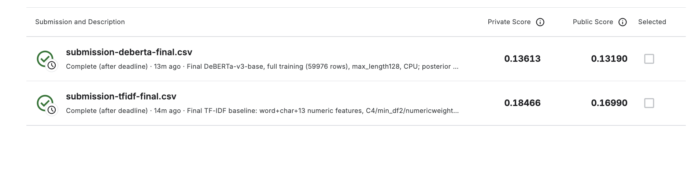

# Sentiment Analysis of Company Reviews

Прогноз оценки компании **от 1 до 5** по англоязычному отзыву. Тестовое задание на данных [Kaggle Company Reviews](https://www.kaggle.com/competitions/sentiment-analysis-company-reviews): исследование данных, сравнение моделей и API в Docker.

## Запуск

Нужен работающий Docker с Compose. Из корня клонированного репозитория:

```bash
docker compose up --build -d --wait
```

Две обученные версии TF-IDF включены в обычный Git. Скачивать данные и обучать модель для запуска сервиса не нужно. Финальные веса DeBERTa поставляются через Git LFS; для них есть [отдельная инструкция запуска](#готовая-deberta-через-git-lfs).

Если нужна только TF-IDF, большой файл DeBERTa можно не скачивать: клонируйте репозиторий с `GIT_LFS_SKIP_SMUDGE=1 git clone <URL-репозитория>`. Стандартная сборка не устанавливает зависимости DeBERTa.

- Swagger и примеры запросов: <http://localhost:8000/docs>
- Проверка готовности: <http://localhost:8000/health>
- Остановка: `docker compose down`. История запросов сохраняется.

## API

```bash
curl http://localhost:8000/predict \
  -H 'Content-Type: application/json' \
  -d '{"Id": 1, "Review": "Excellent service and fast delivery!"}'
```

Ответ: `label` — оценка 1–5, `confidence` — вероятность именно этой оценки. Для минимизации MAE ответ выбирается как медиана предсказанного распределения. Уверенность модели не является гарантией правильности.

Можно передать один объект или массив; порядок ответов сохраняется. `Id` необязателен. Допускаются до 128 отзывов, до 20 000 символов в каждом и до 200 000 символов суммарно. Некорректные данные возвращают ошибку `422` с указанием поля.

Список моделей — `GET /models`. Переключение:

```bash
curl http://localhost:8000/load_model \
  -H 'Content-Type: application/json' -d '{"model_id": "word-only"}'
```

В каталоге зарегистрированы `tfidf` — основная модель, `word-only` — TF-IDF только по словам и биграммам, и `deberta`. Для загрузки `deberta` сначала скачайте LFS-веса и соберите образ с `MODEL_EXTRA=deberta`, как описано ниже. Для возврата к baseline передайте `{"model_id":"tfidf"}`. При ошибке загрузки остаётся прежняя модель; после перезапуска используется `tfidf`.

История успешных прогнозов хранится в SQLite: время, модель и ответы. Текст отзыва по умолчанию не сохраняется; его хранение можно включить через `STORE_REVIEW_TEXT=1 docker compose up -d`.

## Результаты

После удаления точных повторов осталось 59 976 отзывов. Baseline и DeBERTa сравнивались на одинаковых пяти фолдах. Совпадающие после изменения регистра и пробелов отзывы не разделяются между обучением и проверкой.

| Модель | Средняя MAE пяти фолдов |
| --- | ---: |
| Постоянная медиана | 1,43781 |
| TF-IDF по словам и биграммам + Logistic Regression | 0,19008 |
| TF-IDF по словам и символам + 13 числовых признаков + Logistic Regression | 0,18507 |
| **DeBERTa-v3-base: два верхних слоя + голова, одна эпоха** | **0,14371** |

Финальный baseline использует `C=4`, словный `min_df=2` и вес числовых признаков `0,05`. DeBERTa уменьшает среднюю MAE на **0,04137 (22,35%)** относительно этого варианта. Стандартное отклонение пяти MAE DeBERTa — 0,00374 (`ddof=0`); общая OOF MAE — 0,143707483. Ошибки DeBERTa на редких оценках 2–4 остаются заметно выше, чем на 1 и 5; подробности в [решениях](docs/decisions.md).

Признаки и параметры baseline выбирались по этим же фолдам; выбор DeBERTa опирался на первый фолд. Эти результаты не являются независимой итоговой оценкой. MAE baseline взята из выполненного GridSearchCV, метрики DeBERTa пересчитаны из сохранённых проверочных вероятностей. Отдельная финальная DeBERTa обучена на всех 59 976 отзывах и проверена в API и Docker.

### Результаты Kaggle

7 октября 2026 года финальные TF-IDF и DeBERTa, обученные на всех 59 976 очищенных отзывах, отправлены в [Sentiment Analysis — Company Reviews](https://www.kaggle.com/competitions/sentiment-analysis-company-reviews). Обе отправки успешно завершены со статусом `Complete (after deadline)`.

| Модель | Public MAE | Private MAE |
| --- | ---: | ---: |
| Финальный TF-IDF baseline | 0,16990 | 0,18466 |
| **Финальная DeBERTa-v3-base** | **0,13190** | **0,13613** |

Меньшая MAE означает лучший результат. Для обеих моделей оценка выбиралась как медиана предсказанного распределения. Результаты Kaggle и локальной кросс-валидации получены на разных проверочных данных; в кросс-валидации каждый вариант модели обучался на четырёх из пяти фолдов.



*Подтверждение результатов Kaggle от 7 октября 2026 года. DeBERTa получила меньшую MAE на обеих частях тестовой выборки. Отправки сделаны после завершения соревнования.*

## Где что находится

| Файл или папка | Содержание |
| --- | --- |
| [notebooks/eda.ipynb](notebooks/eda.ipynb) | Данные, повторы, распределение оценок, гипотезы о признаках |
| [notebooks/baseline.ipynb](notebooks/baseline.ipynb) | Медиана, понятные отдельные опыты, GridSearchCV и итоговая модель |
| [notebooks/deberta.ipynb](notebooks/deberta.ipynb) | Настройки DeBERTa, пять фолдов и финальное обучение |
| [docs/decisions.md](docs/decisions.md) | Обоснования выбора и результаты экспериментов |
| `company_reviews/` | Признаки, обучение, экспорт моделей и сервис |
| `models/` | Две TF-IDF-модели, финальная DeBERTa (веса через LFS) и каталог для `/load_model` |
| `tests/` | Проверки признаков, обучения, API и истории запросов |

7 октября 2026 года финальный baseline полностью выполнен с чистого ядра: все 31 непустая ячейка кода прошли последовательно без ошибок, включая поиск по 27 сочетаниям параметров (135 обучений на фолдах), обучение лучшего варианта на всех очищенных данных и сохранение для API. Подтвердились выбранные параметры и средняя MAE 0,18507. В DeBERTa сохранены результаты пяти фолдов и отдельного финального обучения.

## Разработка

```bash
uv sync --locked --extra api --extra eda --group dev
uv run --locked pytest -q
uv run --locked python scripts/smoke_api.py
```

Последняя команда проверяет уже работающий API. Ноутбуки используют ядро из `.venv`. Для DeBERTa добавьте `--extra deberta` к команде `uv sync`.

Для повторного обучения поместите файлы соревнования в `data/raw/`. Они не хранятся в Git. Основной baseline можно пройти в ноутбуке или запустить подбор и экспорт одной командой:

```bash
uv run --locked python -m company_reviews.training --tune
```

С `--tune` проверяются все 27 сочетаний `C` 2 / 4 / 8, словного `min_df` 2 / 3 / 5 и веса числовых признаков 0,05 / 0,1 / 0,2 на пяти фолдах: 135 обучений и финальное обучение лучшего варианта. Без `--tune` полная модель обучается с уже выбранными `C=4`, `min_df=2` и весом 0,05. Словный baseline в обоих случаях сохраняет `C=4` и `min_df=5`. Команда заменяет две TF-IDF-модели и обновляет manifest; регистрацию DeBERTa сохраняет.

## Готовая DeBERTa через Git LFS

Установите [Git LFS](https://git-lfs.com/). Из корня клонированного репозитория выполните:

```bash
git lfs install --local
git lfs pull --include="models/deberta/model.safetensors"
git lfs fsck
MODEL_EXTRA=deberta docker compose up --build -d --wait
curl http://localhost:8000/load_model \
  -H 'Content-Type: application/json' -d '{"model_id": "deberta"}'
```

В `models/deberta/` уже находятся конфигурация и токенизатор; LFS загружает настоящий файл весов размером около 738 МБ вместо небольшого текстового указателя. Это финальная модель, обученная на всех 59 976 очищенных отзывах. Данные Kaggle, повторное обучение и команда экспорта для готовой поставки не нужны.

Сборка с `MODEL_EXTRA=deberta` устанавливает CPU-версию PyTorch, Transformers и SentencePiece. Используйте эту переменную и при последующих пересборках с DeBERTa. TF-IDF остаётся моделью по умолчанию; после рестарта DeBERTa нужно снова выбрать через `/load_model`. Во время предсказаний доступ к Hugging Face не требуется.

Если скачивание LFS-весов завершилось ошибкой, не продолжайте сборку с DeBERTa. Подробности получения файлов, проверки контрольных сумм и публикации новой версии — в [инструкции поставки](docs/deberta-delivery.md).

### Повторное обучение DeBERTa

Обучение пяти фолдов и отдельной финальной модели на всех данных:

```bash
.venv/bin/python -u -m company_reviews.deberta_training --mode all --device mps
```

`mps` используется на Apple Silicon; для CPU укажите `--device cpu`. Готовые фолды переиспользуются. Прерванная эпоха запускается заново. Для обучения только финальной модели есть `--mode full`.

После собственного обучения передайте команде экспорта фактический путь финального каталога, напечатанный программой. Для поставляемой версии исходный каталог — `data/cache/deberta_v3_base_full_33305736a2d2`, но после клонирования локального кэша нет. Пример для своего запуска:

```bash
.venv/bin/python -m company_reviews.export_deberta /path/to/full-checkpoint
MODEL_EXTRA=deberta docker compose up --build -d --wait
curl http://localhost:8000/load_model \
  -H 'Content-Type: application/json' -d '{"model_id": "deberta"}'
```

Экспорт заменяет файлы в `models/deberta/` и обновляет контрольные суммы в `models/manifest.json`. При публикации собственной версии коммитьте их вместе: файл весов попадёт в LFS, небольшие файлы — в обычный Git. Кэш обучения и фолдовые модели остаются в игнорируемой папке `data/cache/`. Сервис использует CPU и максимум 128 токенов на отзыв, включая служебные.

## Использование ИИ

При подготовке кода, исследовании решений и проверках использовался OpenAI Codex.
